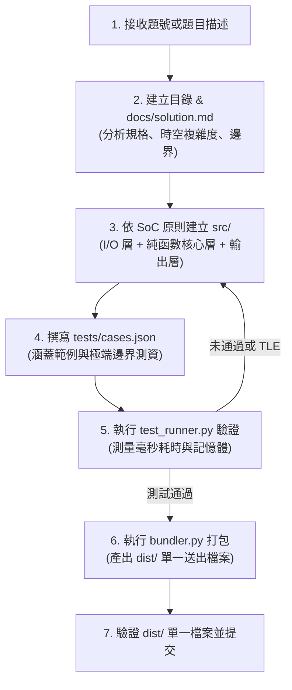

# ZeroJudge 代理式解題技能 (zerojudge-solver)

本技能指導代理式 AI 如何高效、嚴謹地解決 ZeroJudge 上的演算法問題。每個題目均落實：
1. **以題目編號命名專案目錄**（例如 `a001`、`b966`）。
2. **關注點分離 (SoC) 與優先純函數 (Pure Functions)**。
3. **極致時間效能優化 (Fast I/O & Algorithm Optimization)**。
4. **詳盡的解題文檔 (`docs/solution.md`)**。
5. **自動打包導出為單一原始碼 (`dist/<problem_id>_submission.<ext>`)**，方便直接貼上 ZeroJudge。

---

## 支援語言與官方環境

- **C**: `gcc -std=c11 -O2` (ZeroJudge 官方版本: gcc 13.3.0)
- **C++**: `g++ -std=c++17 -O2` (ZeroJudge 官方版本: g++ 13.3.0)
- **Java**: OpenJDK 11.0.31
- **Python**: Python 3.12.3

### 本機編譯器與執行環境路徑 (Local Toolchain Paths)

本地測試與自動編譯時，使用本機已配置之編譯器與直譯器實體路徑：

| 工具 / 語言 | 指令 / 角色 | 本機實體路徑 |
| :--- | :--- | :--- |
| **C++ 編譯器** | `g++` (MinGW 13.1.0, 64-bit) | `C:\Qt\Tools\mingw1310_64\bin\g++.exe` |
| **C 編譯器** | `gcc` (MinGW 13.1.0, 64-bit) | `C:\Qt\Tools\mingw1310_64\bin\gcc.exe` |
| **Python 直譯器** | `python` (Python 3.13.1) | `C:\Python313\python.exe` |
| **Java 編譯器** | `javac` (OpenJDK 25) | `C:\Program Files\Eclipse Adoptium\jdk-25.0.2.10-hotspot\bin\javac.exe` |
| **Java 執行環境** | `java` (OpenJDK 25) | `C:\Program Files\Eclipse Adoptium\jdk-25.0.2.10-hotspot\bin\java.exe` |

> [!NOTE]
> `test_runner.py` 會優先調用上述實體路徑進行本地編譯測試，並使用 `-std=c++17` 與 `-std=c11` 參數模擬 ZeroJudge 線上環境。


---

## 標準解題流程 (SOP)



---

## 各步驟執行細則

### 步驟 1: 建立題目專案目錄

以題號為目錄名稱（如 `a001`），建立以下標準結構：

```text
<problem_id>/
├── docs/
│   └── solution.md          # 解題步驟、推導、複雜度分析 (必備)
├── src/
│   ├── io_handler.hpp (.py) # I/O 處理層 (呼叫 lib/)
│   ├── solver.hpp (.py)     # 核心純函數 (100% 無副作用)
│   └── main.cpp (.py)       # 組裝進入點
├── tests/
│   └── cases.json           # 測試測資集 (含範例與極限值)
└── dist/                    # 打包導出目錄 (由 bundler 自動生成)
```

### 步驟 2: 撰寫 `docs/solution.md`

在編寫任何程式碼前，必須在 `docs/solution.md` 中完成以下內容：
1. **題目理解與規格分析**：輸入、輸出格式、測資範圍 ($N$)、時間限制、記憶體限制。
2. **演算法設計推導**：
   - 核心思路（暴力法 vs 目標演算法、貪婪/動態規劃狀態轉移式、圖論建模）。
   - 邊界情境（$N=0, 1$、負數、極值溢位、EOF 停止條件）。
3. **複雜度分析**：
   - 時間複雜度：嚴格評估 $O(\dots)$，確保在時間限制（如 1.0 秒約 $10^8$ 次運算）內通過。
   - 空間複雜度：$O(\dots)$。

### 步驟 3: 落實 SoC 與純函數

嚴格劃分三層：
1. **I/O 處理層 (`src/io_handler.*`)**：
   - 引用工作區共用庫：
     - C++: `#include "zj_io.hpp"`
     - C: `#include "zj_io.h"`
     - Python: `from zj_io import TokenStream, fast_println`
     - Java: `FastScanner`, `FastPrinter`
   - 負責 EOF 循環判定與資料結構轉換，**不包含任何解題核心邏輯**。
2. **核心解題層 (`src/solver.*`)**：
   - **必須為純函數**：給定 `Input` 結構，回傳 `Output` 結構。
   - 禁止使用全域變數殘留狀態，杜絕多筆測資造成的狀態污染。
3. **進入點 (`src/main.*`)**：
   - 組裝 I/O 與 Solver。

### 步驟 4: 極致效能優化 (避免 TLE)

詳細技巧請參閱 [language-optimizations.md](./references/language-optimizations.md)。
- **C++**: 關閉同步或使用 `zj::FastIO`，禁止 `std::endl`，預先 `reserve` 容器大小。
- **Python**: 務必使用 `TokenStream` (`sys.stdin.read().split()`)，若有 DFS/遞迴需調高 `sys.setrecursionlimit(1_000_000)`。
- **Java**: 嚴禁使用 `java.util.Scanner`，一律使用 `FastScanner` 與 `FastPrinter`。

### 步驟 5: 本地測資驗證與壓測

使用內建工具進行編譯與毫秒級效能測試：

```bash
# 測試模組化 src/
python .agents/skills/zerojudge-solver/scripts/test_runner.py <problem_id> --target src

# 或測試打包後的 dist/
python .agents/skills/zerojudge-solver/scripts/test_runner.py <problem_id> --target dist
```

### 步驟 6: 單一檔案打包導出 (Bundler)

ZeroJudge 提交需要單一檔案。執行打包工具將所有本地 `#include` 與 `lib/` 相依項展開：

```bash
python .agents/skills/zerojudge-solver/scripts/bundler.py <problem_id>
```

產出檔案位於：
`<problem_id>/dist/<problem_id>_submission.<ext>`

此檔案為 100% 獨立無外部依賴之單一原始碼，可直接複製貼上 ZeroJudge。

---

## 相關參考資源

- [SoC 與純函數架構模式](./references/soc-pure-function-pattern.md)
- [各語言極致效能優化手冊](./references/language-optimizations.md)
- [ZeroJudge 避坑手冊](./references/zerojudge-cheatsheet.md)
- [共用 I/O 庫手冊](../../../lib/README.md)
